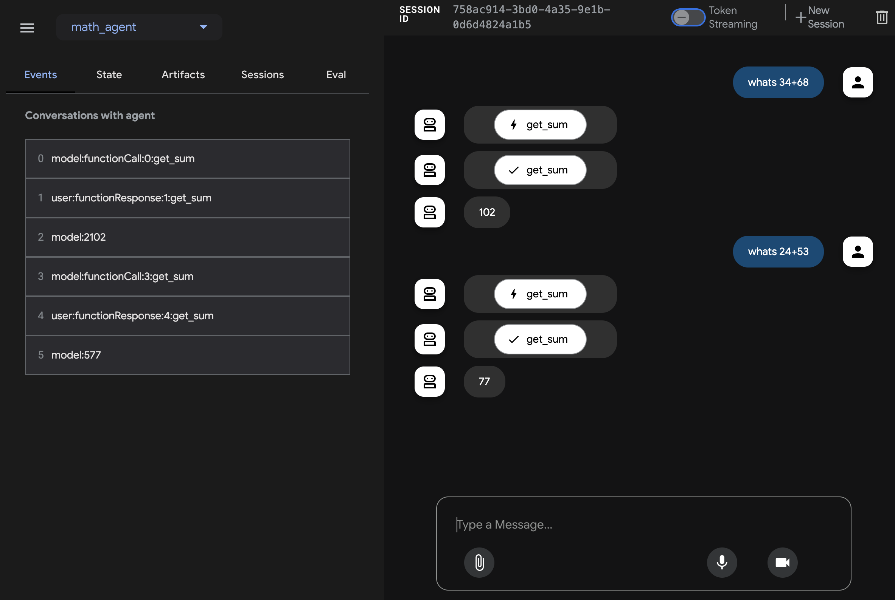

### ADK and FastMCP Server example

This example demonstrates connecting to a remote FastMCP server that provides math operations(eg. addition).

#### Step 0: Deploy FastMCP Server to Cloud Run

Repo link: https://github.com/gitrey/fastmcp-demo

```py
#server.py
from fastmcp import FastMCP
import asyncio

mcp = FastMCP("FastMCP Demo Server")

@mcp.tool()
def add(a: int, b: int) -> int:
    """Add two numbers"""
    return a + b

if __name__ == "__main__":
    asyncio.run(mcp.run_sse_async(host="0.0.0.0", port=8080))
```
Ensure your MCP server project has the following files in the root directory(eg. `./fastmcp-demo`):

*   `server.py`: Your main application code using FastMCP.

*   `requirements.txt`: Lists the Python dependencies.
    ```txt
    fastmcp
    asyncio
    ```

*   `Procfile`: Tells Cloud Run how to start your web server. 
    ```Procfile
    web: python server.py
    ```
    *(Note: This assumes your FastMCP instance is named `mcp` within your `server.py` file. Adjust `server:mcp` if your filename or instance name is different.)*

Execute Cloud Run Deployment command from your FastMCP server directory(eg. `./fastmcp-demo`):
```shell
    gcloud run deploy fastmcp-demo \
        --source . \
        --region YOUR_REGION
```

# Agent config

#### Step 1: Attach the FastMCP Server to your ADK agent via `MCPToolset`

Create `agent.py` and use the following code snippet to define a function that initializes the `MCPToolset`.

* **Important:** Replace Cloud Run service url with the one you deployed in previous step.

```py
# agent.py

import os

import google.auth
from google.adk.agents import Agent
from google.adk.tools.tool_context import ToolContext
from google.adk.tools.mcp_tool.mcp_toolset import MCPToolset, SseServerParams

_, project_id = google.auth.default()
os.environ.setdefault("GOOGLE_CLOUD_PROJECT", project_id)
os.environ.setdefault("GOOGLE_CLOUD_LOCATION", "us-central1")
os.environ.setdefault("GOOGLE_GENAI_USE_VERTEXAI", "True")


async def get_sum(a: int, b: int) -> int:
    """Calculate the sum of two numbers.

    Args:
        a: number
        b: number

    Returns:
        the sum of two numbers.
    """
    common_exit_stack = AsyncExitStack()

    tools, _ = await MCPToolset.from_server(
        connection_params=SseServerParams(
            url="https://fastmcp-demo-00000000000.us-central1.run.app/sse",
            project_id="YOUR-GCP-PROJECT-ID",
            location="us-central1",
        ),
        async_exit_stack=common_exit_stack
    )

    return await tools[0].run_async(
        args={
            "a": a,
            "b": b,
        },
        tool_context=None,
    )

root_agent = Agent(
    name="root_agent",
    model="gemini-2.0-flash",
    instruction="You are a helpful AI assistant designed to provide accurate and useful information.",
    tools=[get_sum],
)
```


#### Step 2: Create an __init__ file

Create an `__init__.py` in the same folder as the `agent.py` above

```python
# __init__.py
from . import agent
```

#### Step 3: Setup credentials to run agent locally

To run the agent locally, you need to set up your Google Cloud credentials. You can do this by setting the `GOOGLE_APPLICATION_CREDENTIALS` environment variable to point to your service account key file.

You can do this by running the following command in your terminal:

```shell
export GOOGLE_APPLICATION_CREDENTIALS=/path/to/service-account-key.json
```
Make sure to replace `/path/to/service-account-key.json` with the actual path to your service account key file.

#### Step 4: Run the agent

Run `adk web` from the repo root directory (ensure your virtual environment is active):

```shell
adk web
```

A successfully interaction will yield a response by accessing your remote FastMCP server, like below:


